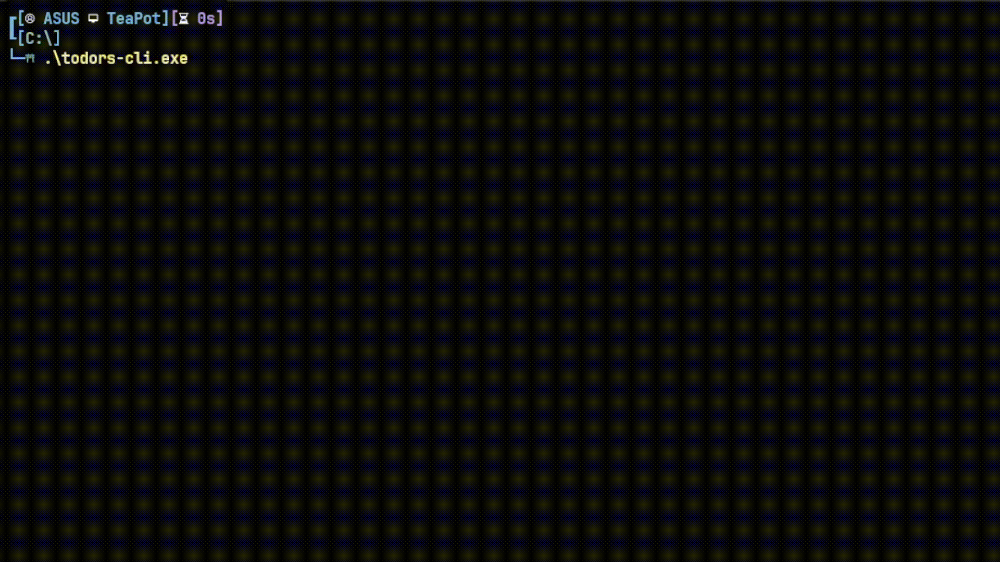

# TODORS-CLI
Just a very simple and minimal todolist that is interactive with Inquire.
## Features (and Plans)
- [x] Adding tasks (Definitely)
- [x] Listing tasks
- [x] Completing tasks
- [x] Deleting tasks
- [ ] Persistent data storing



## Building
### Prerequisites 
- Rust 2021 (>1.56.0)

### Compiling and Building
```bash
cargo build --release
```
